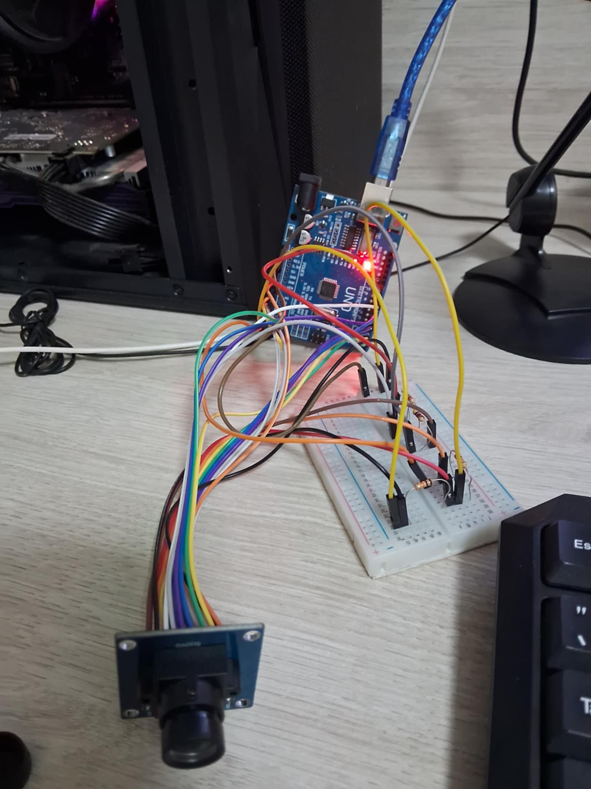

# Reconhecimento facial com Arduino UNO + câmera ov7670.

### Projeto extesionista da disciplina de IoT da Estácio.
#

#### Componentes físicos utilizados:

* Arduino UNO;
* Protoboard 400 Pontos;
* Kit Jumpers Macho/Macho;
* Kit Jumpers Macho/Fêmea;
* Kit Jumpers Fêmea/Fêmea;
* Módulo Câmera ov7670;
* 2 Resistores 10k;
* 2 Resistores 4,7k.

#### Softwares utilizados:

* Python 3.10.11;
* Arduino IDE;
* Biblioteca face-recognition 1.3.0;
* Visual Studio Code;
* Visual Studio Build Tools;
* CMake;
* Biblioteca dlib.
* [SerialPortReader](https://circuitdigest.com/sites/default/files/SerialPortReader.zip)

#### Diagrama do circuito:

#### Circuito montado:

#### Imagem sendo captada e exibida:

#

## Resumo do projeto:

O funcionamento do projeto consiste no [código do arduino](https://github.com/PedroMak/EstacioIoT/blob/master/sketch_jun17a/sketch_jun17a.ino) para inicialização da câmera e manipulação do LED próprio do arduino (associado ao pino 13).  
Com a câmera inicializada, abrimos o SerialPortReader para visualizarmos a imagem, salvamos a imagem pela própria interface do SerialPortReader e em seguida o [código em python](https://github.com/PedroMak/EstacioIoT/blob/master/app.py) realiza o reconhecimento facial com o uso da biblioteca face-recognition.  que irá nos entregar um valor booleano (true ou false). Caso seja `true`, o python devolver para o arduino um sinal para que o LED seja aceso.
#
## Referências:

O esquema para a montagem do arduino, código para inicializar a câmera e o link para download do SerialPortReader foram obtidos no site da [CircuitDigest](https://circuitdigest.com/microcontroller-projects/how-to-use-ov7670-camera-module-with-arduino).